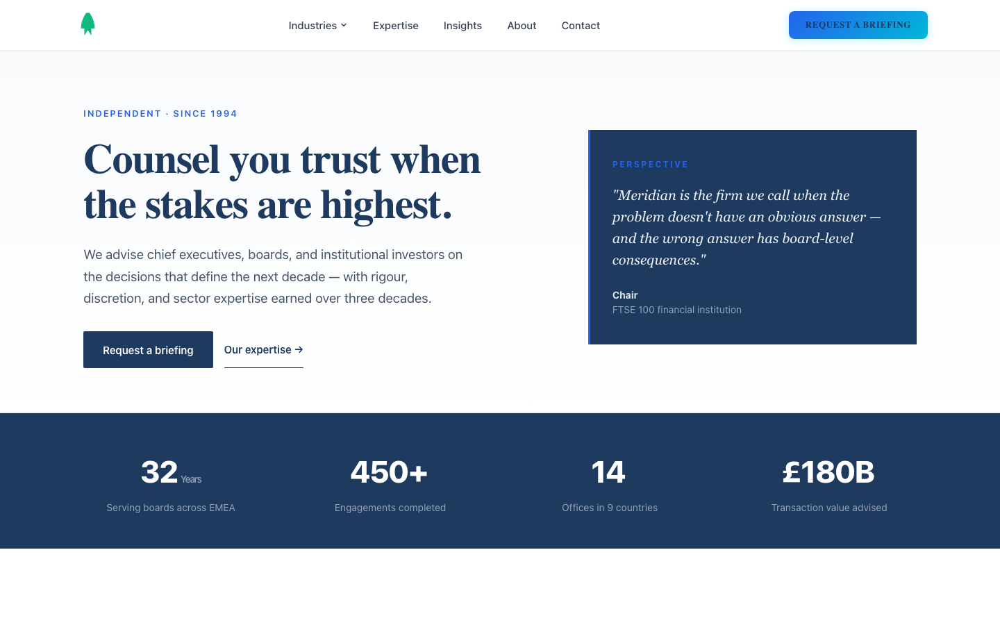
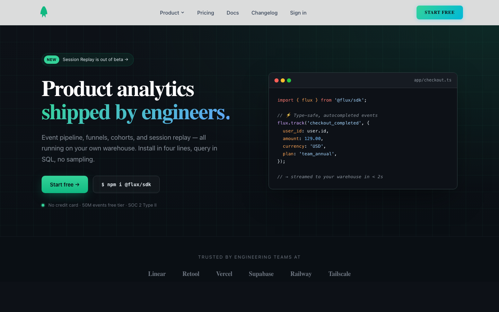
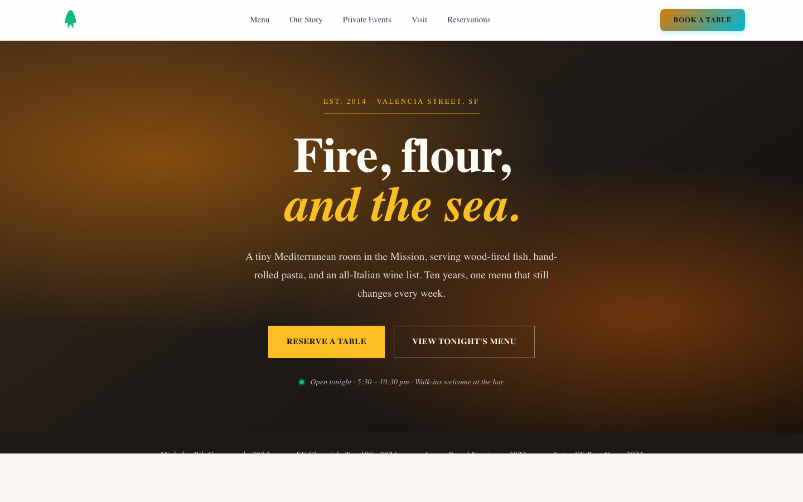
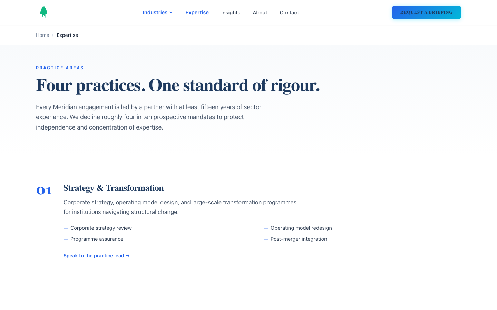
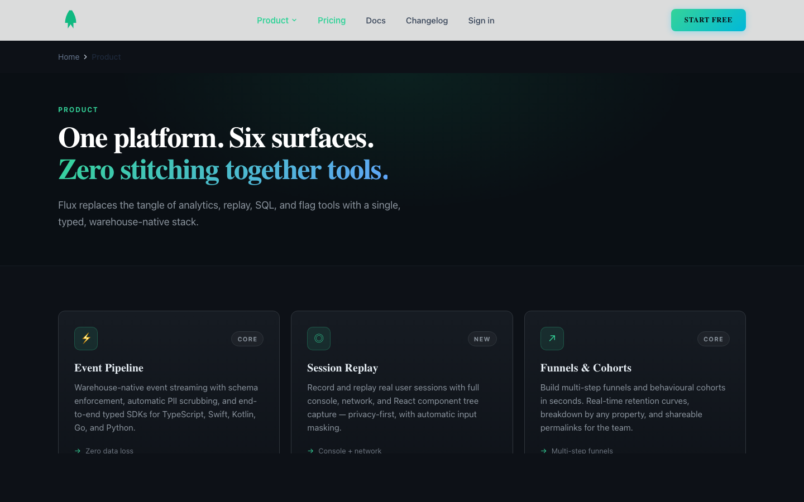
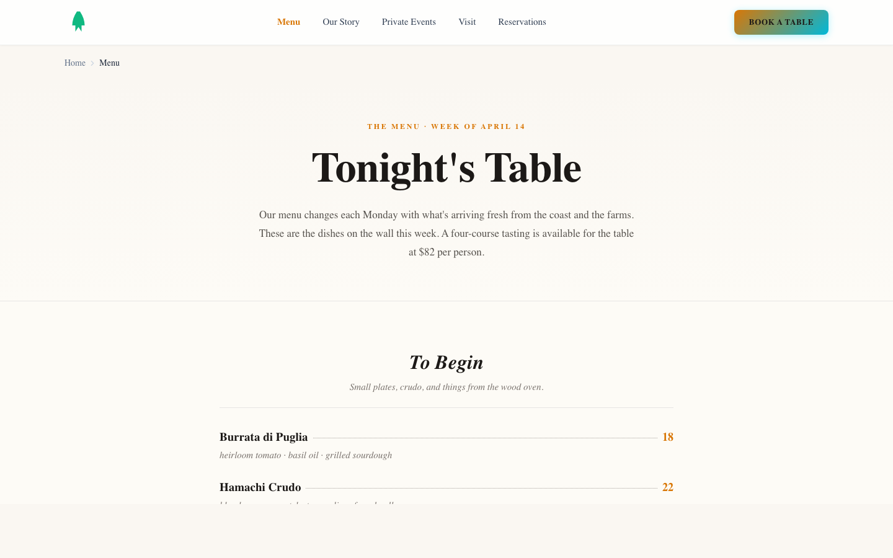
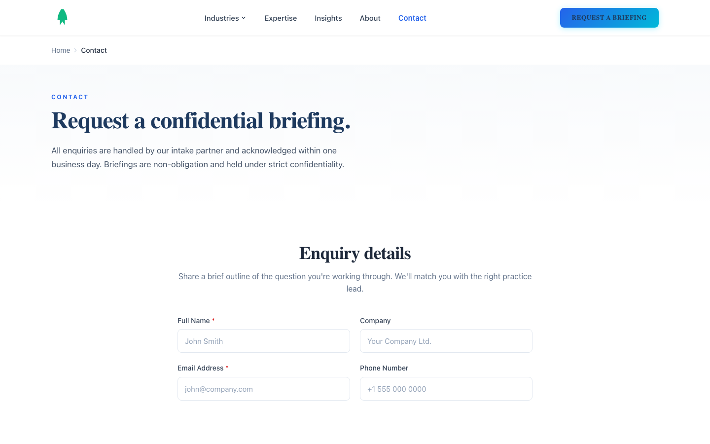
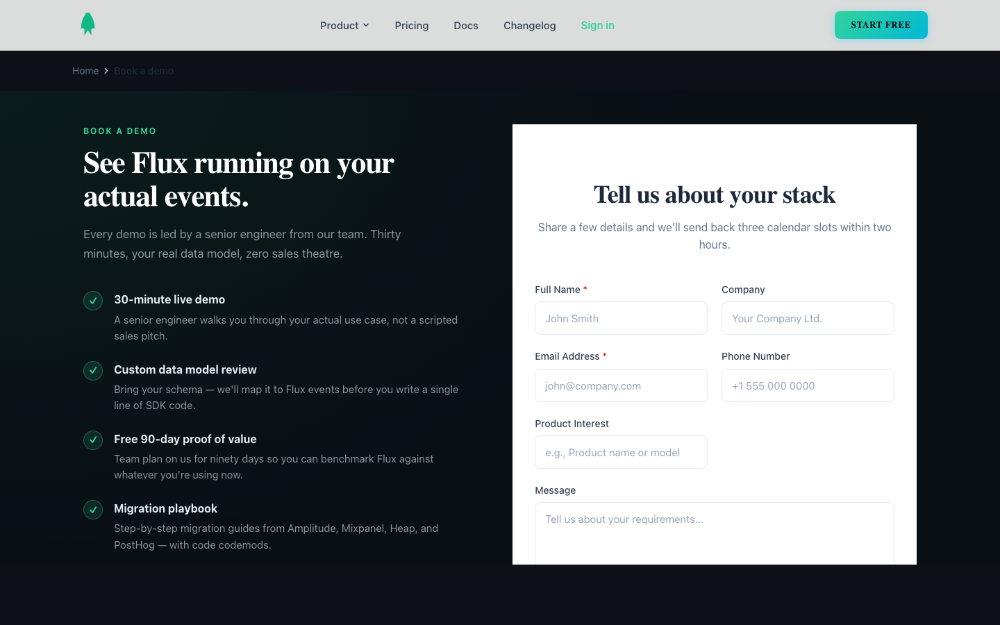
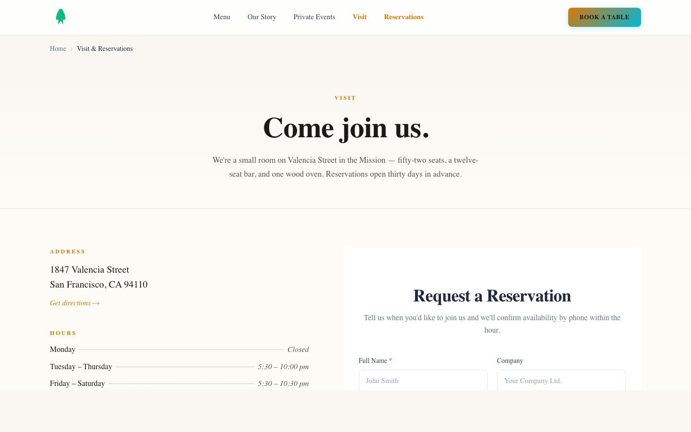

# Astro Fleet

[](https://github.com/Indivar/astro-fleet/actions/workflows/ci.yml) [](https://github.com/Indivar/astro-fleet/releases) [](LICENSE)

One codebase, many sites. A multi-site Astro monorepo starter for agencies and multi-brand companies.

Astro Fleet gives you a production-ready monorepo with shared components, per-site design tokens, Turborepo build orchestration, and deployment to Cloudflare Pages, Vercel, or a self-hosted VPS. Create a new site in one command. Brand it with a design preset. Deploy it independently.

**Built for AI-driven development.** Astro Fleet's project structure, typed component props, and clear configuration patterns are optimized for AI coding assistants. Tested extensively with [Claude Code](https://claude.ai/claude-code). Also works with Gemini CLI and other AI coding tools. [See the AI Workflow Guide →](docs/ai-workflow.md)

## Live Demos

Three fully-built sites — same monorepo, same shared components, three completely different looks and feels. Each demo is a separate site under `sites/` with its own navigation, content, and design preset.

| Preset | Demo | Use Case | Live |
|---|---|---|---|
| **Corporate** | [Meridian Advisory](sites/meridian-advisory.com) | Management consulting firm | [astro-fleet-meridian.pages.dev](https://astro-fleet-meridian.pages.dev) |
| **SaaS** | [Flux Analytics](sites/flux-analytics.com) | Developer-tool product site | [astro-fleet-flux.pages.dev](https://astro-fleet-flux.pages.dev) |
| **Warm** | [Olive & Vine](sites/olive-and-vine.com) | Neighbourhood restaurant | [astro-fleet-olive.pages.dev](https://astro-fleet-olive.pages.dev) |

<table>
  <tr>
    <td align="center"><strong>Corporate → Meridian Advisory</strong></td>
    <td align="center"><strong>SaaS → Flux Analytics</strong></td>
    <td align="center"><strong>Warm → Olive & Vine</strong></td>
  </tr>
  <tr>
    <td></td>
    <td></td>
    <td></td>
  </tr>
  <tr>
    <td></td>
    <td></td>
    <td></td>
  </tr>
  <tr>
    <td></td>
    <td></td>
    <td></td>
  </tr>
</table>

Each demo composes the **same shared components** (`Header`, `Footer`, `ServiceCard`, `ContactForm`, `CTABlock`, `Breadcrumb`) — but the navigation, section structure, hero layouts, and typography are all unique to the brand. The presets aren't colour-swap reskins; they're complete site personalities.

## Built with Astro Fleet

Real sites running in production on the same codebase as the demos above:

- **[vairi.com](https://www.vairi.com)** — AI-enhanced software development and business automation consultancy (Auckland, NZ)
- **[claspt.app](https://www.claspt.app)** — Encrypted markdown notes and password vault, available on the Microsoft Store, macOS, and Linux
- **[stakteck.com](https://www.stakteck.com)** — IT staffing, contract hiring, and staff augmentation across India

_More coming soon._ If you ship a site with Astro Fleet, open a PR adding it here — we'd love to feature it.

## Quick Start

```bash
git clone https://github.com/indivar/astro-fleet.git
cd astro-fleet
bun install
bun run dev          # → starter site at localhost:4321
```

Create your first site:

```bash
./scripts/new-site.sh yourdomain.com saas
bun install
bun run dev --filter=yourdomain.com
```

## What's Included

- **22 shared components + 3 layouts** — Header, Footer, SEO Head, CTA blocks, cards, forms, testimonials, breadcrumbs, pricing tables, FAQ accordions, team grids, timelines, hero sliders, section dividers, comparison tables, and more. All accept content via typed props, all use CSS variables for theming.
- **Design token system** — 3 presets (Corporate, SaaS, Warm) with a TypeScript interface. Create custom presets or modify colors and fonts per site without touching component code.
- **Site scaffolder** — `./scripts/new-site.sh domain.com [preset]` creates a new site from the starter template with the correct config, styles, and build pipeline wired up.
- **Infrastructure templates** — Optional Docker Compose + Traefik + Caddy setup for self-hosting on a VPS. Run `./scripts/setup-infra.sh` to generate configs for your domains.
- **Framework-agnostic** — All components are native `.astro` files (zero JS by default). Need interactivity? Add React, Vue, Svelte, Solid, or Preact to any site — Astro's [Islands Architecture](https://docs.astro.build/en/concepts/islands/) hydrates only the interactive parts.
- **Self-hosted fonts** — Astro 6 Fonts API downloads Google Fonts at build time and serves them from your domain. No runtime requests to third-party servers, better privacy, optimized fallbacks.
- **AI-first workflow** — Designed to be developed with Claude Code, Gemini CLI, or any AI coding assistant. Sample prompts and patterns in the [AI Workflow Guide](docs/ai-workflow.md).

## Documentation

- [Getting Started](docs/getting-started.md) — Clone to first deploy in 15 minutes
- [Adding a Site](docs/adding-a-site.md) — Create and configure additional sites
- [Components Reference](docs/components.md) — Props, usage examples, CSS variables for every component
- [Design Tokens](docs/design-tokens.md) — Branding system, presets, custom palettes
- [Framework Integrations](docs/framework-integrations.md) — Add React/Vue/Svelte, Islands Architecture, View Transitions, Content Collections, and more
- [Deployment](docs/deployment.md) — Cloudflare Pages, Vercel, Netlify, or self-hosted
- [AI Workflow](docs/ai-workflow.md) — Sample prompts, tool setup, AI-driven development patterns

## Stack

Astro 6 · Bun · Turborepo 2 · Tailwind CSS 4 · TypeScript · Static-first (zero JS by default) · Works with React, Vue, Svelte, Solid, Preact

## License

MIT — use it for anything. See [LICENSE](LICENSE).

## Credits

Built by [Indivar Software Solutions](https://indivar.com), a software company based in India and New Zealand. We use Astro Fleet to run our own portfolio of company websites.
