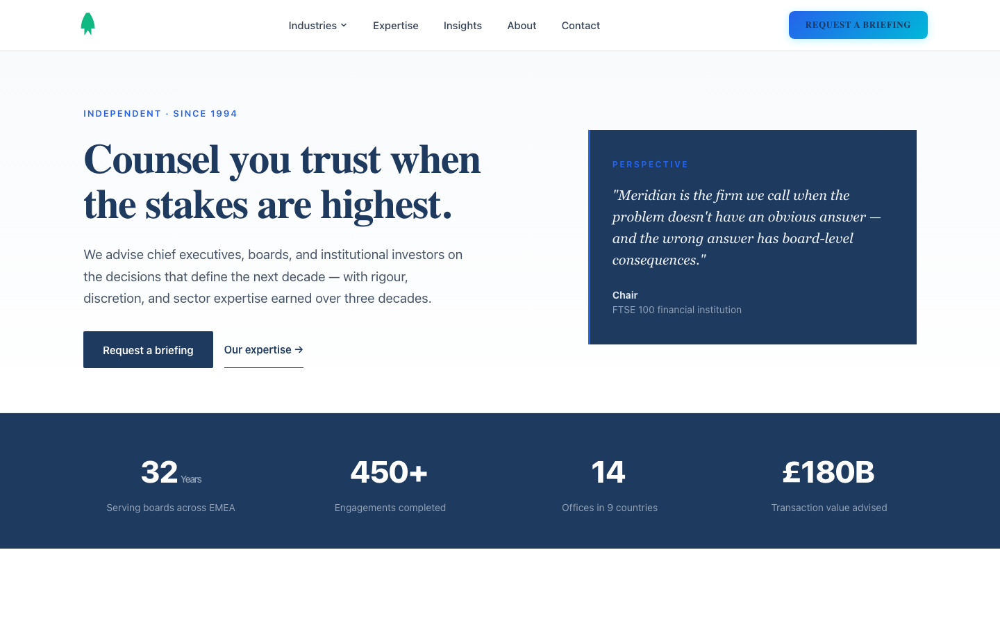
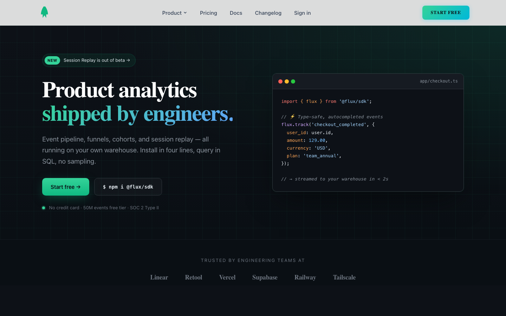
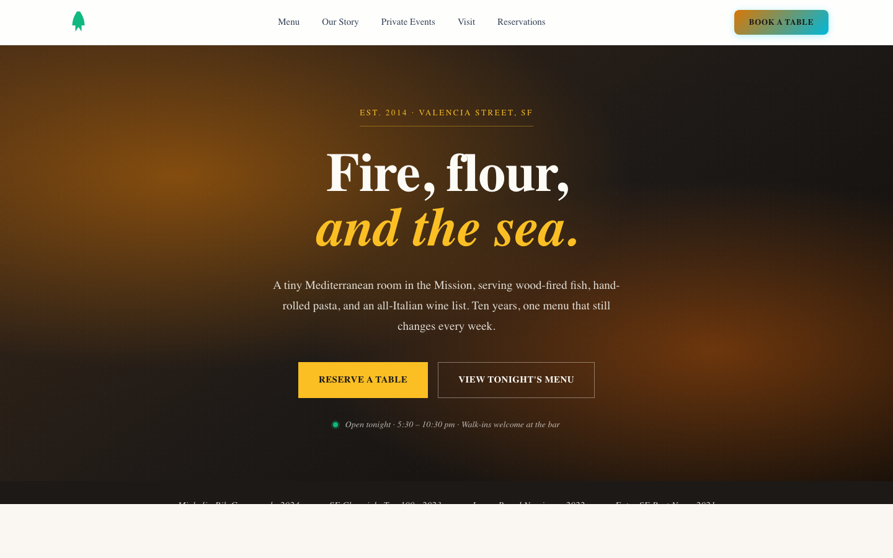
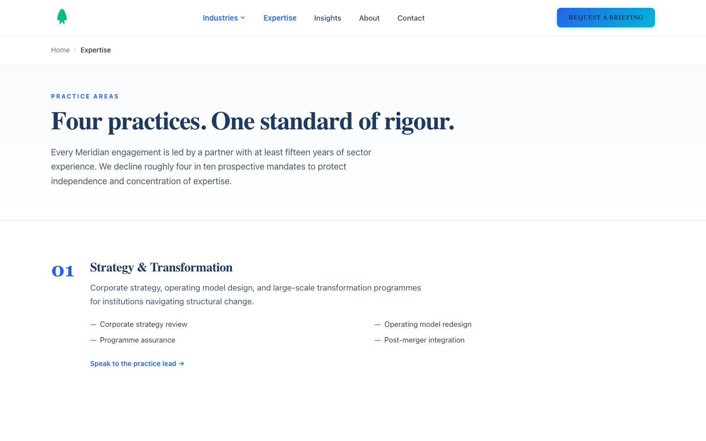
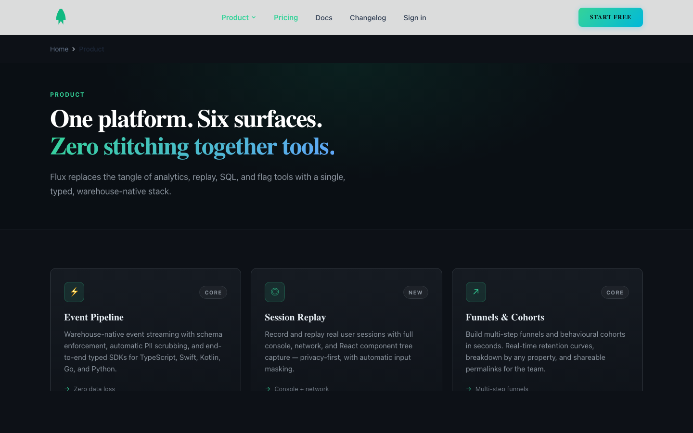
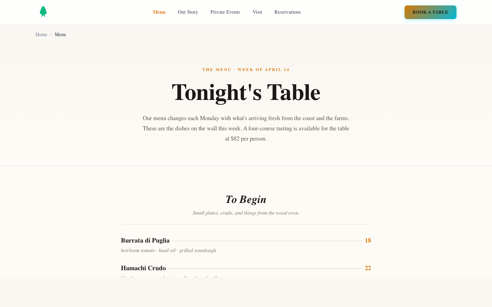
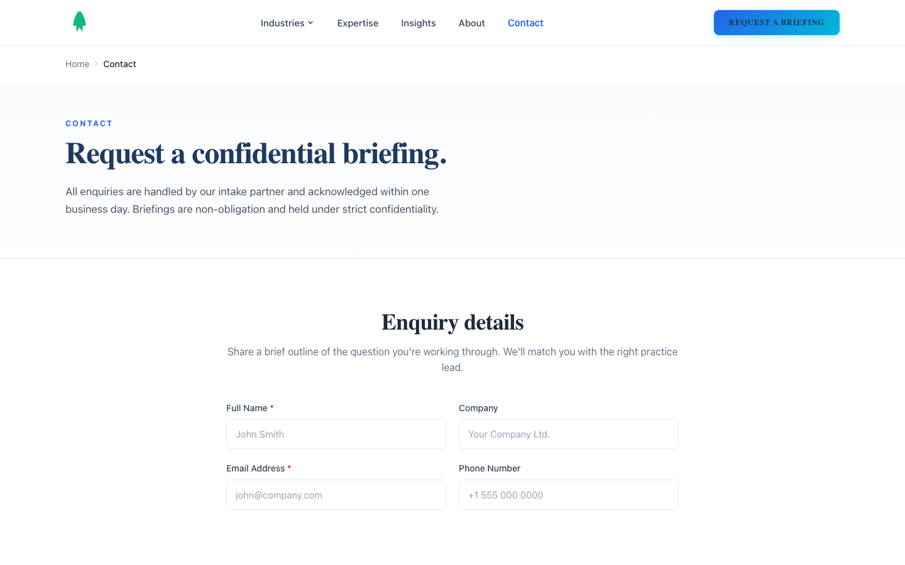
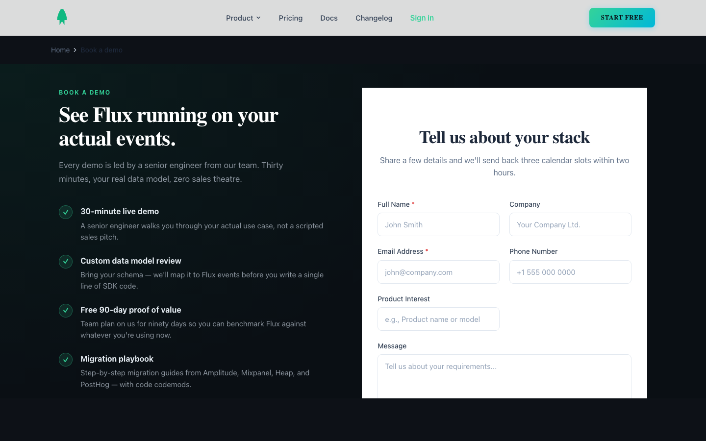
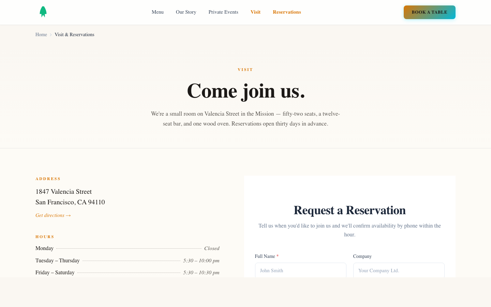

# Astro Fleet

[](https://github.com/Indivar/astro-fleet/actions/workflows/ci.yml) [](https://github.com/Indivar/astro-fleet/releases) [](LICENSE)

**One codebase, many sites.** A multi-site Astro monorepo for agencies and
multi-brand companies.

Shared components, per-site design tokens, Turborepo builds, and independent
deployment to Cloudflare Pages, Vercel or your own VPS. Create a site in one
command, brand it with a preset, ship it on its own domain.

Site-wide search, consent-gated analytics and full SEO are built in and **off by
default** — each is one instruction away.

**Built for AI-driven development.** The structure, typed props and single-file
site config exist so an AI assistant can work in this repo without guessing.
Tested extensively with [Claude Code](https://claude.ai/claude-code); works with
Gemini CLI and others.

---

## Get started

### With Claude Code

The fastest path from nothing to a live site:

```bash
git clone https://github.com/Indivar/astro-fleet.git
cd astro-fleet
bun install
claude
```

Then say what you want:

> Build me a site for acme.com. We fabricate structural steel for commercial
> builders in Auckland. The buyer is a project manager comparing fabricators on
> lead time and certification. I want them to request a quote.

Claude reads [`CLAUDE.md`](CLAUDE.md) automatically and follows the whole
process: scaffold, design, content, SEO, deploy.
**[Build a site with Claude →](docs/build-a-site-with-claude.md)** is the
human-readable walkthrough, with the exact sentences to type at each step.

### With the CLI

```bash
bunx create-astro-fleet         # or: npm create astro-fleet
cd my-astro-fleet
bun install
bun run dev
```

Prompts for a target directory, first-site domain and design preset. Use
`--domain` and `--preset` to skip them.

### By hand

```bash
git clone https://github.com/Indivar/astro-fleet.git
cd astro-fleet
bun install
bun run dev          # starter site at localhost:4321
```

**Requires** Bun 1.1+ and Node 20+. A Cloudflare account is needed only to
deploy, and it is free.

---

## Everyday commands

```bash
# Develop
bun run dev                                    # every site (4321)
bun run dev --filter=acme.com                  # one site
bun run dev --filter=acme.com -- --port 4322   # a second alongside

# Build
bun run build                                  # all, in parallel
bun run build --filter=acme.com                # one

# Typecheck and lint
bun run lint

# Add a site
bunx create-astro-fleet add acme.com saas      # or:
./scripts/new-site.sh acme.com saas
bun install                                     # always, after adding

# Deploy
npx wrangler pages deploy sites/acme.com/dist \
  --project-name=acme-com --branch=main

# Self-hosted infrastructure
./scripts/setup-infra.sh acme.com,other.com
```

---

## Turning features on

Everything is opt-in. Full detail in
[`CLAUDE.md`](CLAUDE.md) §6 and the [components reference](docs/components.md).

### Site search

Add the index generator to the site's build, then switch it on:

```jsonc
// package.json
"build": "astro build && node ../../packages/shared-ui/scripts/search-index.mjs"
```

```astro
<BaseLayout search searchPlaceholder="Pricing, integrations, security" ...>
```

Built from the HTML that actually shipped, fetched on first use and never on
load, about 1.8 KB gzipped per page. `/` or Cmd-K opens it. No search service,
no server, no subscription.

### Analytics, behind consent

```astro
<BaseLayout gaId="G-XXXXXXXXXX" privacyHref="/privacy/" ...>
```

That is the whole integration. **Nothing is requested from Google until the
visitor accepts** — stricter than the usual Consent Mode v2 pattern, which
loads the script immediately with tracking denied. Global Privacy Control is
read as a decline. `requireConsent={false}` restores standard behaviour.

Your numbers will be lower than a site that tags everyone. They will also match
what your privacy page says.

### SEO

Automatic once `site` is set in `astro.config.mjs`: per-page titles and
descriptions, canonicals, Open Graph, Twitter cards, JSON-LD, sitemap.
[SEO Recipes](docs/seo-recipes.md) covers the rest — per-page OG images,
git-based `lastmod`, `llms.txt` for answer engines, IndexNow, fuzzy 404
redirects and build-time validation.

---

## What's included

- **24 shared components + 3 layouts** — header, footer, SEO head, CTA blocks,
  cards, forms, testimonials, breadcrumbs, pricing tables, FAQ accordions, team
  grids, timelines, hero sliders, section dividers, comparison tables, search
  and analytics. Typed props, CSS-variable theming, zero JS unless a component
  needs it.
- **Design token system** — three presets (Corporate, SaaS, Warm) behind a
  TypeScript interface. Change colours and fonts per site without touching
  component code.
- **Site scaffolder** — `bunx create-astro-fleet` or `./scripts/new-site.sh`,
  wiring config, styles and the build pipeline.
- **Search and analytics**, as above.
- **CMS-ready** — the Meridian demo ships with [Keystatic](https://keystatic.com);
  admin at `/keystatic` in dev, content committed as markdown.
  [Adding a CMS](docs/adding-a-cms.md) covers the pattern and the alternatives.
- **Self-hosted fonts** — the Astro Fonts API downloads at build time and serves
  from your domain. No runtime third-party requests.
- **Framework-agnostic** — native `.astro` files throughout. Add React, Vue,
  Svelte, Solid or Preact to any site via Astro's
  [Islands Architecture](https://docs.astro.build/en/concepts/islands/).
- **Infrastructure templates** — optional Docker Compose + Traefik + Caddy for
  self-hosting.
- **An AI operating manual** — [`CLAUDE.md`](CLAUDE.md) carries the whole path
  from prerequisites to DNS, including nine failure modes that ship silently in
  real projects.

---

## Live demos

Three fully-built sites. Same monorepo, same shared components, three
genuinely different looks — the presets are complete site personalities, not
colour swaps.

| Preset | Demo | Use case | Live |
|---|---|---|---|
| **Corporate** | [Meridian Advisory](sites/meridian-advisory.com) | Management consulting firm | [astro-fleet-meridian.pages.dev](https://astro-fleet-meridian.pages.dev) |
| **SaaS** | [Flux Analytics](sites/flux-analytics.com) | Developer-tool product site | [astro-fleet-flux.pages.dev](https://astro-fleet-flux.pages.dev) |
| **Warm** | [Olive & Vine](sites/olive-and-vine.com) | Neighbourhood restaurant | [astro-fleet-olive.pages.dev](https://astro-fleet-olive.pages.dev) |

<table>
  <tr>
    <td align="center"><strong>Corporate → Meridian Advisory</strong></td>
    <td align="center"><strong>SaaS → Flux Analytics</strong></td>
    <td align="center"><strong>Warm → Olive & Vine</strong></td>
  </tr>
  <tr>
    <td></td>
    <td></td>
    <td></td>
  </tr>
  <tr>
    <td></td>
    <td></td>
    <td></td>
  </tr>
  <tr>
    <td></td>
    <td></td>
    <td></td>
  </tr>
</table>

Each composes the **same shared components**. The navigation, section structure,
hero layouts and typography are unique to each brand.

---

## Built with Astro Fleet

Real sites running in production on this codebase:

- **[edubold.com](https://www.edubold.com)** — School management ERP for Indian schools and trusts: admissions, fees, payroll and double-entry accounts on one set of records
- **[moiengineering.com](https://www.moiengineering.com)** — Packaging and wrapping machinery, and a parts catalogue going back to 1960 (Mohali, India)
- **[hybridagrobots.com](https://www.hybridagrobots.com)** — Computer-vision grading and sorting machines for agriculture and poultry
- **[indivar.com](https://www.indivar.com)** — Independent technology consulting: architecture, cloud and delivery
- **[stakteck.com](https://www.stakteck.com)** — IT staffing, contract hiring and staff augmentation across India
- **[vairi.com](https://www.vairi.com)** — AI-enhanced software development and business automation consultancy (Auckland, NZ)
- **[claspt.app](https://www.claspt.app)** — Encrypted markdown notes and password vault, on the Microsoft Store, macOS and Linux

Every URL above was checked and returned 200 on 22 August 2026.

If you ship a site with Astro Fleet, open a PR adding it here.

---

## Documentation

**Start here**

- [Build a site with Claude](docs/build-a-site-with-claude.md) — clone to live domain, step by step
- [Getting Started](docs/getting-started.md) — clone to first deploy in 15 minutes
- [`CLAUDE.md`](CLAUDE.md) — the operating manual Claude reads. Worth reading yourself

**Building**

- [Adding a Site](docs/adding-a-site.md) — create and configure additional sites
- [Components Reference](docs/components.md) — props, examples and CSS variables for all 24
- [Design Tokens](docs/design-tokens.md) — presets and custom palettes
- [Framework Integrations](docs/framework-integrations.md) — React, Vue, Svelte, islands, view transitions
- [Adding a CMS](docs/adding-a-cms.md) — the Keystatic pattern, and when to pick something else

**Shipping**

- [SEO Recipes](docs/seo-recipes.md) — OG images, `llms.txt`, IndexNow, validation
- [Deployment](docs/deployment.md) — Cloudflare Pages, Vercel, Netlify, self-hosted
- [AI Workflow](docs/ai-workflow.md) — prompts, tool setup, AI-driven patterns
- [Changelog](CHANGELOG.md) — what changed, and when

---

## Stack

Astro 6 · Bun · Turborepo 2 · Tailwind CSS 4 · TypeScript · static-first, zero JS
by default · works with React, Vue, Svelte, Solid and Preact

## License

MIT. Use it for anything. See [LICENSE](LICENSE).

## Credits

Built by [Indivar Software Solutions](https://indivar.com), a software company
in India and New Zealand. We use Astro Fleet to run our own portfolio of company
websites — the seven listed above.
